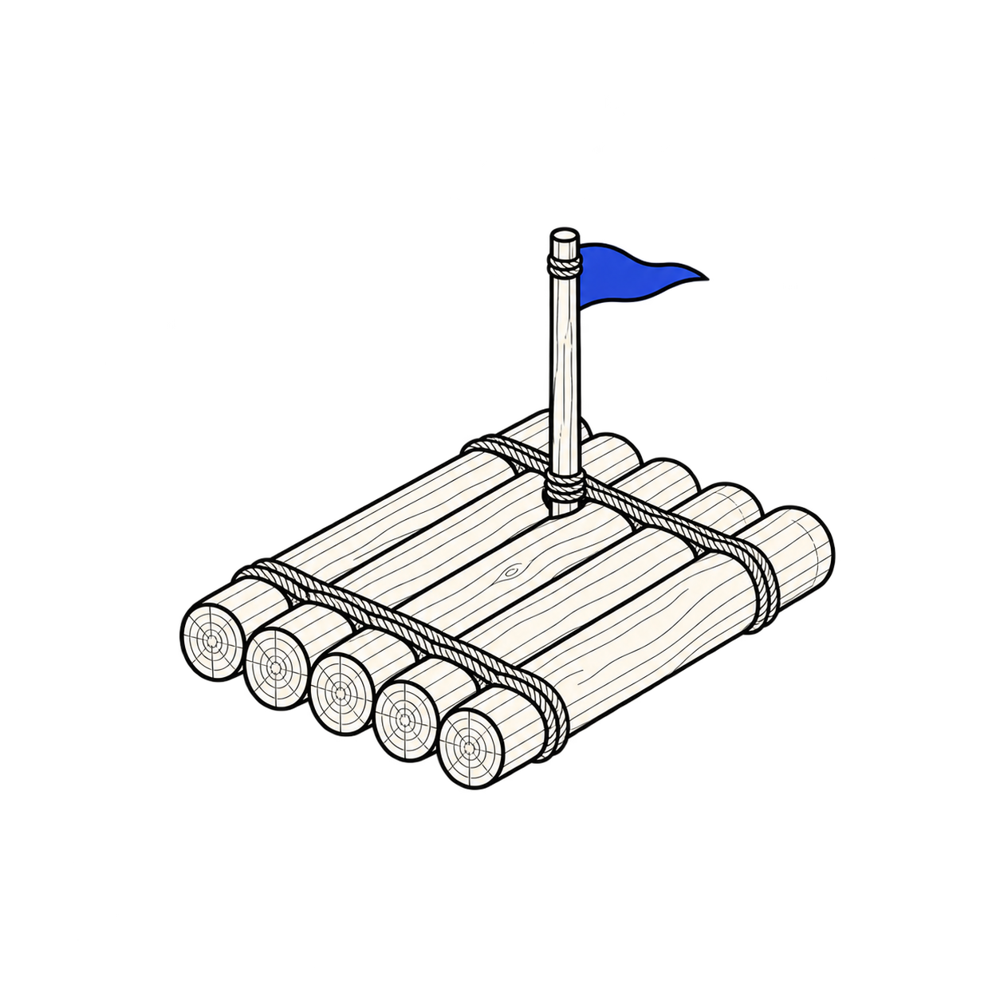

<p align="center">
  
</p>

<h1 align="center">raft</h1>

<p align="center">
  <a href="https://github.com/Microck/raft/actions/workflows/check.yml"></a>
  <a href="LICENSE"></a>
</p>

---

`raft` is an independent, self-hosted open-source alternative to
[boat.dev](https://boat.dev). it gives you persistent Linux boxes on machines you
control, with command execution, Docker, file transfer, snapshots, forks and a
private desktop. Raft is not affiliated with Boat.

[setup](docs/operations.mdx) | [feature parity](docs/boat-capabilities.md) | [verification](docs/verification.mdx) | [agent skill](skills/raft-cli/SKILL.md) | [docs site](https://raft.micr.dev/)

## quickstart

follow the [setup guide](docs/operations.mdx) to install the CLI, configure SSH,
set up Incus and download or build an image.

| requirement | minimum |
| --- | --- |
| host | dedicated ARM64 or AMD64 Ubuntu host, 2 CPUs, 8 GiB RAM, 80 GiB free disk |
| host access | SSH and passwordless sudo |
| controller | Linux, Python 3.11.8+, uv, SSH and SCP |

once your host and image are configured, run the commands below. replace `lab`
with a location from your configuration:

```sh
box=$(raft new --location lab --ttl 600)
raft exec "$box" -- node --version
raft ssh "$box"
raft stop "$box"
```

`raft stop` and expiration keep persistent boxes on disk. `new --disposable`
deletes a temporary box when it stops or expires. `raft resume` starts
the box with a new lifetime. `raft destroy` deletes the box and its snapshots.

each host allows four saved boxes, including stopped ones. `raft limits` reports
current allocations, free disk space and recommended running counts for each
size. see [host capacity](docs/reference/capacity-limits.mdx).

## image and workspace control

the image builder starts with Debian 13 and installs language runtimes,
build tools, Docker, Chromium, FFmpeg and a noVNC desktop. build your own image
or download an image for your host architecture from
[versioned releases](https://github.com/Microck/raft/releases). pin its fingerprint
in your configuration. see
[image builds and boot measurements](docs/boot-performance.mdx) for checks and timings.

see the task guides for [background jobs](docs/guides/background-jobs.mdx),
[file transfer](docs/guides/files.mdx),
[snapshots and forks](docs/guides/snapshots-forks.mdx),
[private services and desktops](docs/guides/desktop-services.mdx),
[backup and recovery](docs/guides/backup-recovery.mdx)
and [Docker](docs/guides/docker.mdx).

stop the source box before taking a snapshot, restoring one or making a fork.
stopping a box ends its jobs without saving process memory.

backups include the box's files and credentials. keep them private and import
only trusted exports. a long backup can delay expiration checks on its host.

## startup performance

median startup times from five runs per architecture on native Ubuntu 24 CI
hosts. each box had one CPU, 2 GiB RAM and a cached image:

| measurement | ARM64 | AMD64 |
| --- | ---: | ---: |
| command ready after create | 0.87 s | 1.38 s |
| Docker ready after create | 2.28 s | 3.04 s |
| desktop, after its separate start request | 1.12 s | 1.59 s |
| compressed development image | 1.79 GiB | 1.86 GiB |

times depend on hardware, installed software and services, storage, image cache
and SSH latency. the measurements include CLI and SSH overhead. they exclude
image downloads and host reboots.

the first image unpack can take longer. the runners used different hardware,
so these results do not show that ARM64 is faster.

both native images passed the lifecycle tests and all 31 development-tool checks. see
[measurements and methodology](docs/boot-performance.mdx) for raw samples,
resume timings and the measured image-size and desktop-startup improvements.

## feature parity

✅ supported · ❌ unavailable · ❓ not established in Boat's docs. matching checks
do not imply identical behavior. the [full comparison](docs/boat-capabilities.md)
records differences, sources and test coverage.

| Capability | Boat | Raft | Raft limits / differences |
| --- | :---: | :---: | --- |
| Self-hosting on operator hardware | ❌ | ✅ | Incus on your hosts |
| Native ARM64 workspaces | ❌ | ✅ | Boat documents x86_64 machines only |
| Create/list/inspect/delete | ✅ | ✅ | Single operator |
| Persistent stop/resume | ✅ | ✅ | Shared host kernel |
| TTL and lifetime extension | ✅ | ✅ | Persistent boxes retain disk; disposable boxes delete |
| CPU/memory sizing and usage | ✅ | ✅ | 1 or 2 CPUs, 1, 2 or 4 GiB RAM. Disk usage covers the shared pool |
| Host capacity recommendations | ❌ | ✅ | Raft recommends running capacity and enforces four saved boxes. Boat reports plan limits |
| Root terminal and command execution | ✅ | ✅ | Host SSH transport |
| Background jobs, logs and cancellation | ✅ | ✅ | No process checkpoints |
| File upload/download | ✅ | ✅ | Files and recursive trees; new directory destinations only |
| Snapshots and same-host forks | ✅ | ✅ | Stopped source, checked under the lifecycle lock |
| Deploy/delete named snapshots | ✅ | ✅ | Same-host templates and named snapshot deletion |
| Portable backup/recovery | ❓ | ✅ | Raft native archives; Boat whole-instance archive import is not established |
| Docker and development tools | ✅ | ✅ | Native ARM64 and AMD64 images. See [image tests](docs/boot-performance.mdx) |
| Private port forwarding | ✅ | ✅ | Local SSH tunnel |
| Desktop access | ✅ | ✅ | noVNC; see verification limits |
| Reverse forwarding | ✅ | ❌ | Not implemented |
| Public workspace hosting and browser-only streaming | ✅ | ❌ | Not implemented |
| Resize on resume/fork | ✅ | ✅ | Optional CPU/RAM overrides within supported sizes |
| CLI-wide JSON mode | ✅ | ❌ | Boat JSON/JSONL; Raft only list/info/usage/limits |
| Snapshot file browsing/download | ✅ | ❌ | Whole-box backup only |
| Strict per-box disk quotas | ✅ | ❌ | Shared 60 GiB Btrfs pool |
| Separate-kernel VM isolation | ✅ | ❌ | Container runtime |
| Named environments and managed secrets | ✅ | ❌ | Manual configuration |
| Organizations and webhooks | ✅ | ❌ | Raft is single-operator; no event API |
| Dashboard, remote API and SDK | ✅ | ❌ | CLI only |
| Managed agent conversations | ✅ | ❌ | Not implemented |
| Automatic deletion and retention | ✅ | ✅ | Disposable deletion; opt-in age-based prune with preview |
| CLI self-update | ✅ | ❌ | Standard Python package installation |

## verification and development

run `uv sync --locked` to install dependencies and `uv run raft --help` to check
the CLI. [verification](docs/verification.mdx) lists the real-host test suites.
they create disposable boxes and remove only their own fixtures.

the optional `--restart-incus` check restarts the host's Incus daemon. run it on
dedicated test infrastructure.

the tests cover Raft's behavior. they do not compare it against the live Boat
service. Raft has not had a security audit.

read [the contract](docs/contract.md), [architecture and references](docs/boat-parity-design.md)
and the optional [agent skill](skills/raft-cli/SKILL.md).

## license

[MIT](LICENSE). third-party tools retain their own licenses.
